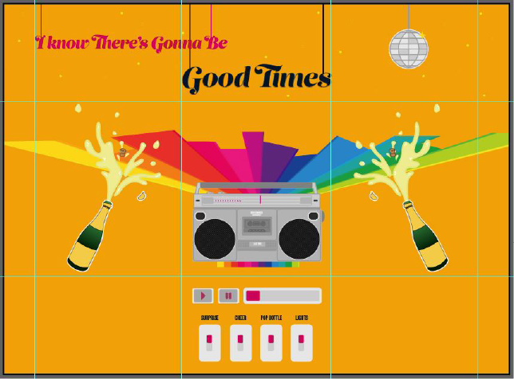

# :tada:  Good Times :champagne:
## An Interactive Audio Project
___

#### :page_with_curl: LAYOUT

  
  
  Grid - 10% / 26% / 28% / 26% / 10%
___

#### :point_up_2: INTERACTIVITY
 

##### -- **Buttons** --

natural state: as is\
activated: grey 50% opacity overlay

1. Play
   - play [music file]
2. Pause
   - stop [music file]

##### -- **Switches** --

switch-bottom.png: off\
switch-top.png: on

1. Surprise
   - switch is activated
   - rainbow.gif is displayed

2. Disco Lights
   - comes down from top: disco-ball-down.gif is displayed
   - disco-ball-blink.png plays on continuous loop overlayed on disco-ball-down.gif     until switch is turned off
   - goes back up: disco-ball-down.gif and disco-ball-blink.png is hidden and disco-ball-up.gif is displayed

3. Pop Bottle
   - switch activated:
       - bottle-closed-lefft.png and bottle-closed-right.png hidden
      - bottle-open-left.png and bottle-open-right.png displayed
   - reset when switch turned off:
      - bottle-open-left.png and bottle-open-right.png hidden
      - bottle-closed-lefft.png and bottle-closed-right.png displayed

4. Cheering
    - turns on and plays on loop until switch is turned off
___

#### :loud_sound: AUDIO 
- Celebration song
- Champagne Pop
- Cheering
___

#### :eyeglasses: STYLE

- background: #F2A007
- font: #011526
- highlight: #D90452, #CC0066
- font-family: 'Oswald', sans-serif
- font-family: 'Open Sans', sans-serif
___